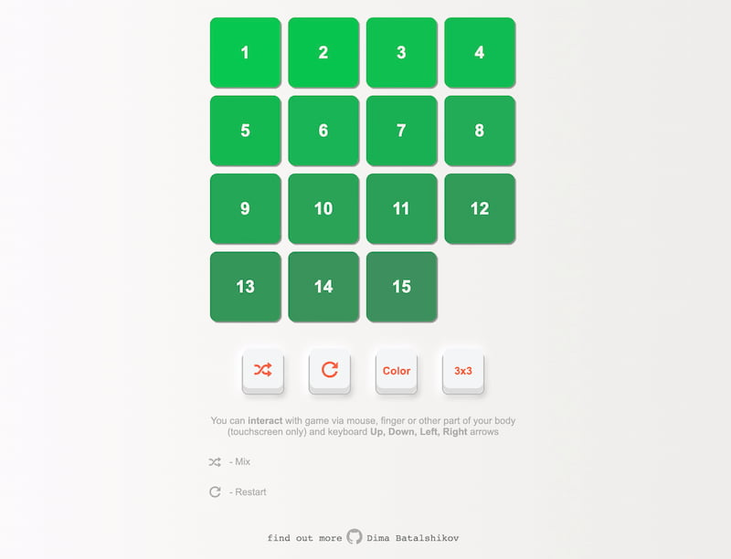
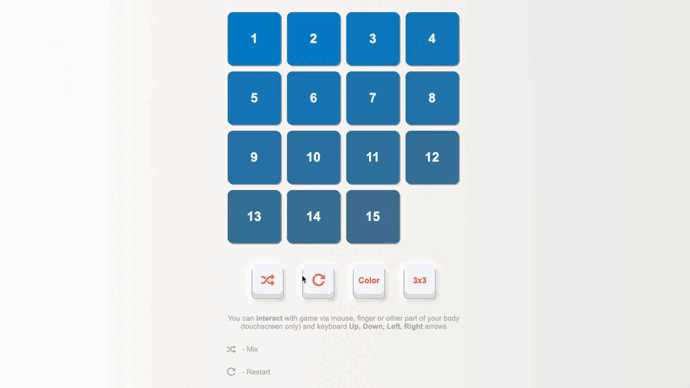

PUZZLE Game
===
GitHub pages: [Demo Link](https://damiandream.github.io/puzzle/)

In this project based on such listed below tech: 
- for HTML was used `PUG`   link: [pughtml.com](https://pughtml.com/) 😵‍💫
- for CSS was used `Stylus`   link: [stylus-lang.com](https://stylus-lang.com/) 🧐
- for JavaScript was used `JavaScript` 😁
- as task-runner was `Gulp`   link: [gulpjs.com](https://gulpjs.com/)

Gif demo:
